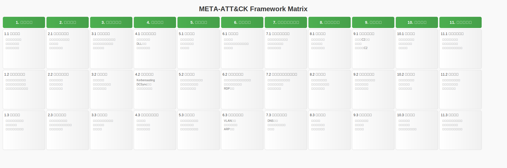
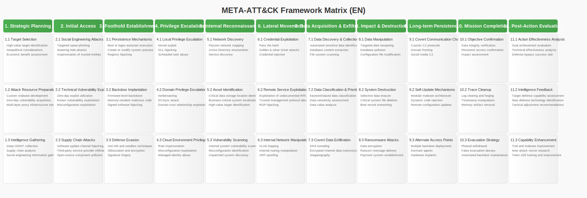

# META-ATT&CK-Framework
A comprehensive knowledge base of actionable offensive security techniques based on ATT&CK Framework

基于 ATT&CK 框架的可操作攻击性安全技术的综合知识库

## 1. 战略规划 (Strategic Planning)
[对应ATT&CK战术: Reconnaissance (TA0043), Resource Development (TA0042)]

此阶段涉及攻击前的准备工作，包括目标选择、资源准备和情报收集。

### 1.1 目标选择 (Target Selection)
- 高价值目标识别 [Gather Victim Identity Information (T1589)]
- 地缘政治考量 [Gather Victim Org Information (T1591)]
- 经济利益评估 [Gather Victim Org Information (T1591)]

### 1.2 攻击资源准备 (Attack Resource Preparation)
- 定制化恶意软件开发 [Develop Capabilities (T1587)]
- 零日漏洞获取和储备 [Exploit Public-Facing Application (T1190)]
- 多层代理基础设施搭建 [Acquire Infrastructure (T1583)]

### 1.3 情报收集 (Intelligence Gathering)
- 深度开源情报（OSINT）收集 [Search Open Websites/Domains (T1593)]
- 供应链分析 [Gather Victim Org Information (T1591)]
- 社交工程信息收集 [Phishing for Information (T1598)]

## 2. 初始访问 (Initial Access)
[对应ATT&CK战术: Initial Access (TA0001)]

此阶段涉及攻击者首次进入目标网络的方法。

### 2.1 社会工程攻击 (Social Engineering Attacks)
- 定向鱼叉式网络钓鱼 [Phishing: Spearphishing Attachment (T1566.001)]
- 水坑攻击 [Drive-by Compromise (T1189)]
- 假冒可信实体 [Impersonation (T1534)]

### 2.2 技术漏洞利用 (Technical Vulnerability Exploitation)
- 零日漏洞利用 [Exploit Public-Facing Application (T1190)]
- 已知漏洞利用（如Log4j、ProxyLogon）[Exploit Public-Facing Application (T1190)]
- 配置错误利用 [Exploit Public-Facing Application (T1190)]

### 2.3 供应链攻击 (Supply Chain Attacks)
- 软件更新渠道劫持 [Supply Chain Compromise (T1195)]
- 第三方服务提供商渗透 [Trusted Relationship (T1199)]
- 开源组件污染 [Supply Chain Compromise (T1195)]

## 3. 立足点建立 (Foothold Establishment)
[对应ATT&CK战术: Persistence (TA0003), Defense Evasion (TA0005)]

此阶段涉及攻击者在目标系统中建立长期访问的方法。

### 3.1 持久化机制 (Persistence Mechanisms)
- 引导或登录自启动执行 [Boot or Logon Autostart Execution (T1547)]
- 创建或修改系统进程 [Create or Modify System Process (T1543)]
- 注册表劫持 [Hijack Execution Flow (T1574)]

### 3.2 后门植入 (Backdoor Implantation)
- 固件级后门 [BIOS/UEFI Firmware Modifications (T1542.001)]
- 内存驻留恶意代码 [Reflective Code Loading (T1620)]
- 签名软件劫持 [Hijack Execution Flow (T1574)]

### 3.3 防御规避 (Defense Evasion)
- 反虚拟机和沙箱技术 [Virtualization/Sandbox Evasion (T1497)]
- 混淆和加密 [Obfuscated Files or Information (T1027)]
- 签名伪造 [Subvert Trust Controls (T1553)]

## 4. 权限提升 (Privilege Escalation)
[对应ATT&CK战术: Privilege Escalation (TA0004)]

此阶段涉及攻击者获取更高级别系统权限的方法。

### 4.1 本地权限提升 (Local Privilege Escalation)
- 内核漏洞利用 [Exploitation for Privilege Escalation (T1068)]
- DLL劫持 [Hijack Execution Flow: DLL Search Order Hijacking (T1574.001)]
- 计划任务滥用 [Scheduled Task/Job (T1053)]

### 4.2 域权限提升 (Domain Privilege Escalation)
- Kerberoasting [Steal or Forge Kerberos Tickets: Kerberoasting (T1558.003)]
- DCSync攻击 [OS Credential Dumping: DCSync (T1003.006)]
- 域信任关系利用 [Domain Trust Discovery (T1482)]

### 4.3 云环境权限提升 (Cloud Environment Privilege Escalation)
- 角色假冒 [Valid Accounts (T1078)]
- 配置错误利用 [Unsecured Credentials: Cloud Instance Metadata API (T1552.005)]
- 托管身份滥用 [Use of Application Access Token (T1550.001)]

## 5. 内部侦察 (Internal Reconnaissance)
[对应ATT&CK战术: Discovery (TA0007)]

此阶段涉及攻击者在目标网络内部收集信息的方法。

### 5.1 网络发现 (Network Discovery)
- 被动网络映射 [Network Sniffing (T1040)]
- 活动目录枚举 [Domain Trust Discovery (T1482)]
- 服务发现 [System Service Discovery (T1007)]

### 5.2 资产识别 (Asset Identification)
- 关键数据存储位置识别 [Data from Information Repositories (T1213)]
- 业务关键系统定位 [System Location Discovery (T1614)]
- 高价值目标识别 [System Network Configuration Discovery (T1016)]

### 5.3 漏洞扫描 (Vulnerability Scanning)
- 内部系统漏洞扫描 [Network Service Scanning (T1046)]
- 错误配置识别 [Network Service Scanning (T1046)]
- 未打补丁系统发现 [Network Service Scanning (T1046)]

## 6. 横向移动 (Lateral Movement)
[对应ATT&CK战术: Lateral Movement (TA0008)]

此阶段涉及攻击者在目标网络内部扩展控制范围的方法。

### 6.1 凭证利用 (Credential Exploitation)
- 传递哈希 [Use Alternate Authentication Material: Pass the Hash (T1550.002)]
- 黄金票据和白银票据攻击 [Steal or Forge Kerberos Tickets: Golden Ticket (T1558.001)]
- 凭证注入 [Account Manipulation: SSH Authorized Keys (T1098.004)]

### 6.2 远程服务利用 (Remote Service Exploitation)
- 利用未记录的远程调用过程 [Exploitation of Remote Services (T1210)]
- 利用可信管理协议（如WMI、PowerShell Remoting）[Remote Services (T1021)]
- RDP劫持 [Remote Services: Remote Desktop Protocol (T1021.001)]

### 6.3 内部网络操纵 (Internal Network Manipulation)
- VLAN跳跃 [Exploitation of Remote Services (T1210)]
- 内部路由操纵 [Network Boundary Bridging (T1599)]
- ARP欺骗 [Network Sniffing (T1040)]

## 7. 数据获取与渗出 (Data Acquisition and Exfiltration)
[对应ATT&CK战术: Collection (TA0009), Exfiltration (TA0010)]

此阶段涉及攻击者收集和传输目标数据的方法。

### 7.1 数据发现与收集 (Data Discovery and Collection)
- 自动化敏感数据识别 [Automated Collection (T1119)]
- 数据库内容提取 [Data from Information Repositories (T1213)]
- 文件系统扫描 [File and Directory Discovery (T1083)]

### 7.2 数据分类与优先级排序 (Data Classification and Prioritization)
- 基于关键字的数据分类 [Automated Collection (T1119)]
- 数据敏感度评估 [Data Staged (T1074)]
- 数据价值分析 [Data from Information Repositories (T1213)]

### 7.3 隐蔽数据渗出 (Covert Data Exfiltration)
- DNS隧道 [Exfiltration Over Alternative Protocol: Exfiltration Over DNS (T1048.001)]
- 加密通道数据传输 [Encrypted Channel: Asymmetric Cryptography (T1573.002)]
- 隐写术 [Steganography (T1027.003)]

## 8. 影响与破坏 (Impact and Destruction)
[对应ATT&CK战术: Impact (TA0040)]

此阶段涉及攻击者对目标系统造成破坏或影响的方法。

### 8.1 数据操纵 (Data Manipulation)
- 定向数据篡改 [Data Manipulation: Stored Data Manipulation (T1565.001)]
- 数据库污染 [Data Manipulation: Stored Data Manipulation (T1565.001)]
- 配置文件修改 [Data Manipulation: Stored Data Manipulation (T1565.001)]

### 8.2 系统破坏 (System Destruction)
- 选择性数据擦除 [Data Destruction (T1485)]
- 系统关键文件删除 [Data Destruction (T1485)]
- 引导记录覆盖 [Data Destruction (T1485)]

### 8.3 勒索攻击 (Ransomware Attacks)
- 数据加密 [Data Encrypted for Impact (T1486)]
- 勒索消息投放 [Data Encrypted for Impact (T1486)]
- 支付系统建立 [Data Encrypted for Impact (T1486)]

## 9. 长期驻留 (Long-term Persistence)
[对应ATT&CK战术: Persistence (TA0003), Command and Control (TA0011)]

此阶段涉及攻击者维持长期访问和控制的方法。

### 9.1 隐蔽通信通道 (Covert Communication Channels)
- 自定义C2协议 [Application Layer Protocol: Web Protocols (T1071.001)]
- 域前置 [Domain Fronting (T1090.004)]
- 社交媒体C2 [Application Layer Protocol: Web Protocols (T1071.001)]

### 9.2 自我更新机制 (Self-Update Mechanisms)
- 模块化恶意软件架构 [Software Packing (T1027.002)]
- 动态代码注入 [Process Injection (T1055)]
- 远程配置更新 [Ingress Tool Transfer (T1105)]

### 9.3 备用接入点 (Alternate Access Points)
- 多重后门部署 [Create or Modify System Process (T1543)]
- 休眠代理 [Scheduled Task/Job (T1053)]
- 硬件植入 [Hardware Additions (T1200)]

## 10. 行动完成 (Mission Completion)
[对应ATT&CK战术: Exfiltration (TA0010), Impact (TA0040)]

此阶段涉及攻击者完成目标并清理痕迹的方法。

### 10.1 目标确认 (Objective Confirmation)
- 数据完整性验证 [Data Staged (T1074)]
- 持久访问确认 [Automated Exfiltration (T1020)]
- 影响评估 [Data Destruction (T1485)]

### 10.2 痕迹清理 (Trace Cleanup)
- 日志清除和伪造 [Indicator Removal: Clear Windows Event Logs (T1070.001)]
- 时间戳篡改 [Timestomp (T1070.006)]
- 内存痕迹清理 [Indicator Removal on Host (T1070)]

### 10.3 撤离策略 (Evacuation Strategy)
- 分阶段撤离 [Data Staged (T1074)]
- 假撤离诱饵 [Exfiltration Over C2 Channel (T1041)]
- 后门维护的自动化 [Automated Exfiltration (T1020)]

## 11. 后行动评估 (Post-Action Evaluation)
[无直接对应ATT&CK战术]

此阶段涉及攻击者评估行动效果并进行能力提升的方法。

### 11.1 行动效果分析 (Action Effectiveness Analysis)
- 目标达成度评估
- 技术有效性分析
- 防御绕过成功率统计

### 11.2 情报反馈 (Intelligence Feedback)
- 目标防御能力评估
- 新防御技术识别
- 战术调整建议

### 11.3 能力提升 (Capability Enhancement)
- 工具和恶意软件改进
- 新攻击向量研究
- 团队技能培训和提升
